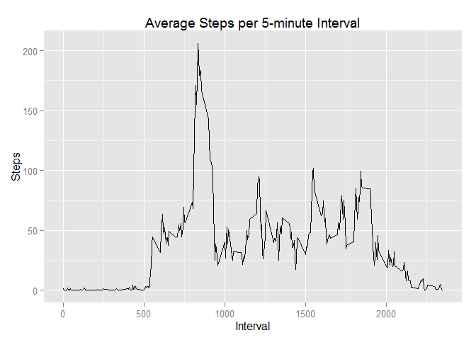

# Reproducible Research: Peer Assessment 1


## Loading and preprocessing the data

```r
library(dplyr)
```

```
## 
## Attaching package: 'dplyr'
## 
## The following objects are masked from 'package:stats':
## 
##     filter, lag
## 
## The following objects are masked from 'package:base':
## 
##     intersect, setdiff, setequal, union
```

```r
library(magrittr)
activity.data <- read.csv("E:/My Documents/Coursera/Reproducible Research/activity.csv") %>% tbl_df() #reads the data. I had no need to process it further at this point.
```

## What is mean total number of steps taken per day?

What is mean total number of steps taken per day?
For this part of the assignment, you can ignore the missing values in the dataset.

Calculate the total number of steps taken per day.


```r
library(ggplot2)

steps.day <- activity.data %>%
  filter(complete.cases(.)) %>% #filters out rows with NA values
  group_by(date) %>%
  summarize(day_total = sum(steps))  #calculates total steps for each day

head(steps.day)
```

```
## Source: local data frame [6 x 2]
## 
##         date day_total
##       (fctr)     (int)
## 1 2012-10-02       126
## 2 2012-10-03     11352
## 3 2012-10-04     12116
## 4 2012-10-05     13294
## 5 2012-10-06     15420
## 6 2012-10-07     11015
```

If you do not understand the difference between a histogram and a barplot, research the difference between them. Make a histogram of the total number of steps taken each day

```r
g <- ggplot(steps.day, aes(x = day_total))
g+geom_histogram()+ggtitle("Histogram of steps taken per day")+xlab("Day Totals")+ ylab("Frequency") #plot histogram
```

```
## stat_bin: binwidth defaulted to range/30. Use 'binwidth = x' to adjust this.
```

 

Calculate and report the mean and median of the total number of steps taken per day


```r
mean(steps.day$day_total) #mean
```

```
## [1] 10766.19
```

```r
median(steps.day$day_total) #median
```

```
## [1] 10765
```


## What is the average daily activity pattern?
Make a time series plot (i.e. type = "l") of the 5-minute interval (x-axis) and the average number of steps taken, averaged across all days (y-axis)


```r
library(ggplot2)
library(dplyr)
library(magrittr)

steps.interval <- activity.data %>%
  filter(complete.cases(.))%>% #filters out NA rows
  group_by(interval)%>%
  summarize(avg = mean(steps)) #calculates the average number of steps for each interval

g <- ggplot(steps.interval, aes(x=interval, y = avg))
g+geom_line()+ggtitle("Average Steps per 5-minute Interval")+xlab("Interval")+ ylab("Steps") #plot line graph
```

 

Which 5-minute interval, on average across all the days in the dataset, contains the maximum number of steps?

```r
filter(steps.interval, avg == max(steps.interval$avg)) #shows the five minute interval with the maximum number of steps. The interval 835 in this case.
```

```
## Source: local data frame [1 x 2]
## 
##   interval      avg
##      (int)    (dbl)
## 1      835 206.1698
```

## Imputing missing values

Note that there are a number of days/intervals where there are missing values (coded as NA). 
The presence of missing days may introduce bias into some calculations or summaries of the data.

Calculate and report the total number of missing values in the dataset (i.e. the total number of rows with NAs)


```r
all.na <- activity.data %>%
  filter(!complete.cases(.)) %>%  #returns only the rows that have NA values
  summarize(total = n()) #counts the number of rows
all.na
```

```
## Source: local data frame [1 x 1]
## 
##   total
##   (int)
## 1  2304
```

```r
activity.data.avg <-  activity.data %>% 
  group_by(interval) %>%
  mutate(interval_avg = mean(interval, na.rm = TRUE)) #add new column with step averages for each interval
```

Devise a strategy for filling in all of the missing values in the dataset.
The strategy does not need to be sophisticated. For example, you could use the
mean/median for that day, or the mean for that 5-minute interval, etc.

Create a new dataset that is equal to the original dataset but with the missing data filled in.


```r
#create loop that replaces NA values with average step count for that interval

for(i in seq(length(activity.data.avg$date))){
  if(is.na(activity.data.avg$steps[[i]]) == TRUE) {
    activity.data.avg$steps[[i]] <- activity.data.avg$interval_avg[[i]]
  }
}
  
activity.new <- activity.data.avg[,1:3] # new dataset
anyNA(activity.new)  #check for NA values
```

```
## [1] FALSE
```

```r
head(activity.new)
```

```
## Source: local data frame [6 x 3]
## Groups: interval [6]
## 
##   steps       date interval
##   (dbl)     (fctr)    (int)
## 1     0 2012-10-01        0
## 2     5 2012-10-01        5
## 3    10 2012-10-01       10
## 4    15 2012-10-01       15
## 5    20 2012-10-01       20
## 6    25 2012-10-01       25
```

Make a histogram of the total number of steps taken each day and Calculate and report the mean
and median total number of steps taken per day. Do these values differ from the estimates from
the first part of the assignment? What is the impact of imputing missing data on the estimates
of the total daily number of steps?


```r
steps.day.new <- activity.new %>% #creates new dataset with total steps per day
  group_by(date) %>%
  summarize(day_total = sum(steps)) 

g <- ggplot(steps.day.new,aes(day_total))

g+geom_histogram(binwidth = 2500)+ggtitle("Histogram of steps taken per day")+xlab("Day Totals")+ ylab("Frequency") #plot histogram
```

 

```r
mean(steps.day.new$day_total)
```

```
## [1] 53828.98
```

```r
median(steps.day.new$day_total)
```

```
## [1] 11458
```
By replacing the NA data with the interval means, the new dataset is skewed to the right.

The new mean is almost 5 times the mean of the original data and the new median is almost 11 times larger than the original median.

Further inspection of the steps.day totals shows that several observations are the same, which probably means several days had entirely NA data.  


## Are there differences in activity patterns between weekdays and weekends?

For this part the weekdays() function may be of some help here. Use the dataset with the filled-in missing values for this part.

Create a new factor variable in the dataset with two levels – “weekday” and “weekend” indicating whether a given date is a weekday or weekend day.


```r
activity.dow <- activity.new %>%
  mutate(day = weekdays(as.POSIXct(date))) #create new variable identifying the day of week

activity.dow$week.pos <- sapply(activity.dow$day, function(x){
  if(x %in% c("Sunday", "Saturday")){factor("weekend")}
  else {factor("weekday")}}) # makes a new variable showing if the day is a weekend or weekday

head(activity.dow)
```

```
## Source: local data frame [6 x 5]
## Groups: interval [6]
## 
##   steps       date interval    day week.pos
##   (dbl)     (fctr)    (int)  (chr)   (fctr)
## 1     0 2012-10-01        0 Monday  weekday
## 2     5 2012-10-01        5 Monday  weekday
## 3    10 2012-10-01       10 Monday  weekday
## 4    15 2012-10-01       15 Monday  weekday
## 5    20 2012-10-01       20 Monday  weekday
## 6    25 2012-10-01       25 Monday  weekday
```

Make a panel plot containing a time series plot (i.e. type = "l") of the 5-minute interval (x-axis) and the average number of steps taken, averaged across all weekday days or weekend days (y-axis). See the README file in the GitHub repository to see an example of what this plot should look like using simulated data.


```r
activity.dow.avg <- activity.dow %>%
  group_by(interval, week.pos) %>%
  mutate(mean = mean(steps))


g <- ggplot(activity.dow.avg, aes(x=interval, y = mean))
g+geom_line()+facet_grid(week.pos~.)+ggtitle("Avg Steps per Interval on Weekdays and Weekends")+ xlab("Interval")+ylab("Steps")
```

 


 The overall pattern of steps seems to be similar. There seems to be have a bit more variation during the 10000 - 2000 interval range during the weekends.
